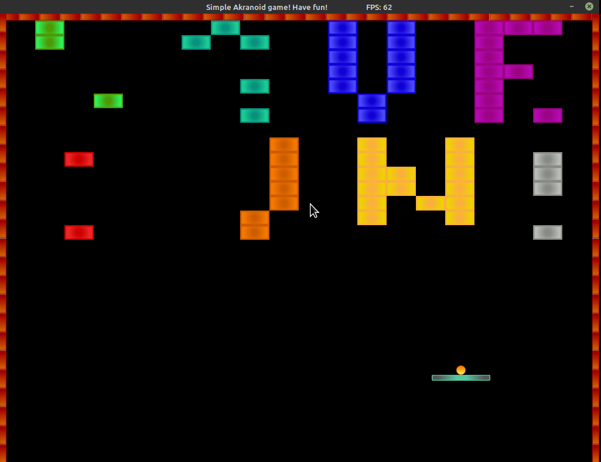

# simple Arkanoid - a capstone project for C++ Nanodegree Program

As a final capstone project for the [Udacity C++ Nanodegree Program](https://www.udacity.com/course/c-plus-plus-nanodegree--nd213) I have chosen to create a simple remake of classic game Arkanoid.
Therefore I have called the project simpleArkanoid. It was done completely from scratch, using SDL framework.

In this single player game, the player tries to destroy all the blocks on the current level with the ball. The player needs to prevent the ball from escaping the bottom border of the game window. To this aim, the player uses the paddle, which can be moved left, right (within wall limits) and up and down (within invisible rectangle limiting the area of movement).

The game is controlled via keyboard. The detail instructions are displayed on the welcome/pause screen, which can be displayed whenever player wishes, by simply pausing the game.

On each level the ball speed is increased. However, the player can increase the ball speed in steps to unlimited value at will (and own responsibility) each time the ball hits the paddle by holding the correct key. The speed can also be decreased when hitting the paddle, but no more then to the minimum speed determined by the game level.

When the ball hits the paddle, it's direction can be altered slightly to the left or right (again - by holding the correct key in the correct moment).

Currently the game has only 10 levels implemented, but introducing new levels is fairly easy and fast, as each level data is stored in a text-file. Therefore, almost unlimited number of levels can be introduced by creating new text files. Important thing to remember is to keep the structure of the level file and naming convention.
Furthermore, for convenience, an empty level pattern is enclosed in the level folder. To help create the level, a calculation sheet is contained in the level folder as well. It doesn't have direct correspondence to creation of a level, but helps create the visual layout of a level first, which can later be entered into the level file manually.

Tthe game supports textures and basic sound effects. There is plenty of space for enhancing the game features.

Obviously, the game is programmed in the C++. The framework used is SDL (with additional SDL_image, SDL_ttf and SDL_mixer libraries).

All the sound effects files are downloaded from the [https://mixkit.co/free-sound-effects/](https://mixkit.co/free-sound-effects/) as free to use. All the textures are simple hand drawings created personally (which can easily by seen as I have no drawing skills at all...).

Thank you for trying out my capstone project and thank you in advance for understanding, that it's not a fully featured top notch version of the original Arkanoid game (at this stage at least).

Have fun!

## Dependencies for Running Locally

- cmake >= 3.16 (it is likely that the project should build using previous versions)
  - All OSes: [click here for installation instructions](https://cmake.org/install/)
- make >= 4.1 (Linux, Mac), 3.81 (Windows)
  - Linux: make is installed by default on most Linux distros
  - Mac: [install Xcode command line tools to get make](https://developer.apple.com/xcode/features/)
  - Windows: [Click here for installation instructions](http://gnuwin32.sourceforge.net/packages/make.htm)
- SDL2 >= 2.0
  - All installation instructions can be found [here](https://wiki.libsdl.org/Installation) > Note that for Linux, an `apt` or `apt-get` installation is preferred to building from source.
    > IMPORTANT NOTE: accept the main SDL library also SDL_Image, SDL_Mixer and SDL_ttf suport needs to be installed.
    > Some additional information on installation can be found [here](https://lazyfoo.net/tutorials/SDL/06_extension_libraries_and_loading_other_image_formats/index.php).
    > And on many places on the Internet.
- gcc/g++ >= 9.3 (it is likely that the project should build using previous versions)
  - Linux: gcc / g++ is installed by default on most Linux distros
  - Mac: same deal as make - [install Xcode command line tools](https://developer.apple.com/xcode/features/)
  - Windows: recommend using [MinGW](http://www.mingw.org/)

## Basic Build Instructions

1. Clone this repo.
2. Make a build directory in the top level directory: `mkdir build && cd build`
3. Compile: `cmake .. && make`
4. Run it: `./simpleArkanoid`.

## Overview of the code structure REVIEW:

The project is structured into classes, seperated into header files (contained in "headers" folder) and source files ("src" folder).

There are two shallow inheritence hierarchies:

1.  The StaticObject is an abstract base class for non movable game objects displayed on the screen.
    The class is inherited by the folling clasess:

    - the class SideWall - which is displayed on the right, left and top side of the screen and is responsible for limiting the ball movement area,
    - the class Block - which represents a block to be destroyed by the ball,
    - the class TextElement - which represents a static rendered text to be displayed on the screen (currently it is heavily used on the pause screen, game over screen, the screen displayed after level completion and after the game is won).

2.  The MovableObject base class is an abstract base class for objects which can move on the game screen.
    The class is inherited by the following classes:
    - the Ball class - which represents the ball moving on the screen,
    - the Paddle class - represents a paddle used for preventing the ball from falling down the bottom limit of the screen and for directing the ball towards the blocks to be destroyed.

Appart from the above mentioned inheritence hierarchies, the code is organised into following non-iheritance classes:

1.  the class Game - obviously represents the main game object.
    In a seperate header (SDLinitializer.hpp) and source file (SDLinitializer.cpp) there are grouped 3 helper classes for the Game class:

    - SDLinitializer class - for SDL main subsystems RAII management,
    - ImageInitializer class - for RAII management of SDL_image support,
    - TTFinitializer class - for RAII management of SDL_ttf (true type font) support.
      Objects of above classes are used as components of the Game class, which initialized in the correct order provide convenient and exception safe way to intialize and close SDL framework features.

2.  the class Controller - a component of the Game class, responsible for handling the keyboard input / stearing.

3.  the class Renderer - a component of the Game class, responsible for displaying the game objects onto the screen.

4.  the class LevelData - a component of the Game class, which loads and stores all data specific to the level from a level file.

5.  the class RandNum - a lightweight random number generating class (currently a component of the Ball class, but due to the usage of static functions can be accessed even whithout object instatiation in other places of the code); the class is enclosed into gMath namespace (as for game math).

6.  the class AudioMixer - which is responsible for providing sound effects support, namely loading and replaying .wav files.
    Together (defined with same header file and implemented in the other source file) with the AudioMixer class is the MixOpener helper class for the AudioMixer class. It's sole purpose is to provide correct initialization, acquiring resources, realeasing resources and closing of SDL Mixer engine in a RAII way.

7.  the class Texture - used as an enhanced wrapper for SDL_Texture, image file loading into texture and generating textures from text. It is used as a component of StaticObject and Movable object-inheriting classes (Block, SideWall, Ball, Paddle and TextElement).

8.  the class TextElement - derived publicly from StaticObject and representing a rendered true type font text to be displayed.

9.  the class Vector2d - a basic component class for all StaticObjects and MovableObjects - inherited classes. In the project it is used to represent a position and a velocity vector. Vector2d class is enclosed into gMath namespace together with RandNum class (although in seperate files) and some helper standalone functions.

10. IntervalTimer class - a simple component class allowing measuring intervals of time, which are used for game state update calculations.

11. LimitTimer class - a simple class used for incorporating frame rate limiting policy (in the implementation of the Game::Run function) and for FPS calculations inside of Renderer::UpdateTitleBar function.

12. SDLexception class - a custom made exception class used for error handling policy related to all SDL related problems.

There are 3 standalone header files (not directly related to any class) used for convenient grouping of:

- all the enum classes used in the project - the Enum.hpp file,
- constants with color definitions - the Colors.hpp file,
- all the constants with paths to assets used in the project - the Paths.hpp.
